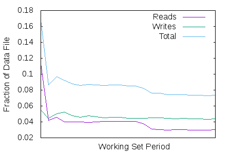
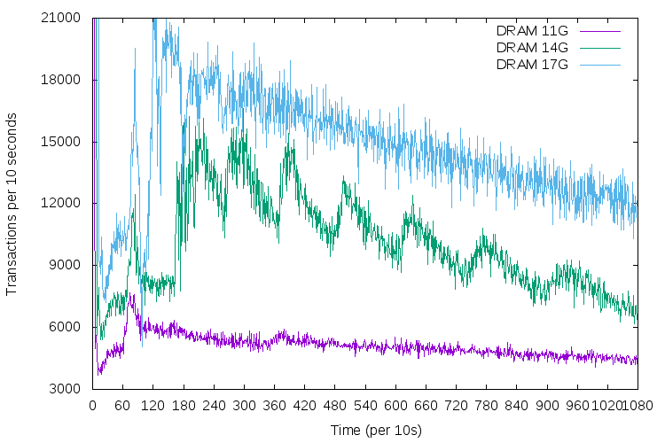
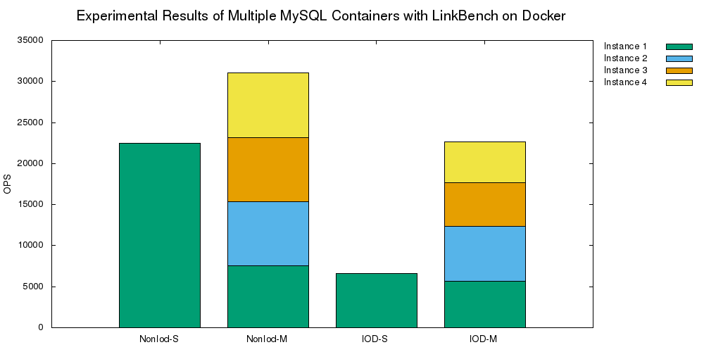
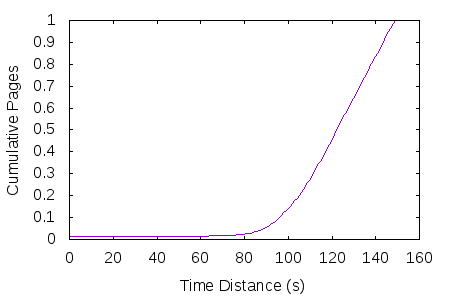
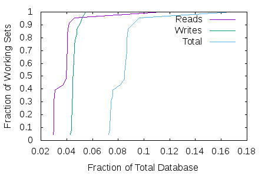

# gnuplot Examples

## Line Graph

### `basic-line-graph.png`

```bash
$ plot-basic-line-graph.sh sample1.txt basic-line-graph
```



- [Script](plot-basic-line-graph.sh)
- [Sample data](sample-data/sample1.txt)

### `basic-line-graph2.png`

```bash
$ plot-basic-line-graph2.sh sample2.txt basic-line-graph2
```



- [Script](plot-basic-line-graph2.sh)
- [Sample data](sample-data/sample2.txt)

### `line-chart-with-named-xtics.eps`

```bash
$ plot-line-chart-with-named-xtics.sh sample4.txt line-chart-with-named-xtics
```


- [Script](plot-line-chart-with-named-xtics.sh)
- [Sample data](sample-data/sample4.txt)

## Bar Graph

### `stacked-bar-chart.png`

```bash
$ plot-stacked-bar-chart.sh sample5.txt stacked-bar-chart
```



- [Script](plot-stacked-bar-chart.sh)
- [Sample data](sample-data/sample5.txt)

## Cumulative Graph

### `cumul-graph.png`

```bash
$ plot-cumul-graph.sh sample3.txt cumul-graph
```



- [Script](plot-cumul-graph.sh)
- [Sample data](sample-data/sample3.txt)

### `multiple-cumul-graph.png`

```bash
$ plot-multiple-cumul-graph.sh sample1.txt multiple-cumul-graph
```



- [Script](plot-multiple-cumul-graph.sh)
- [Sample data](sample-data/sample1.txt)